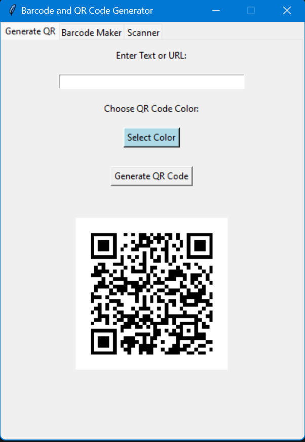
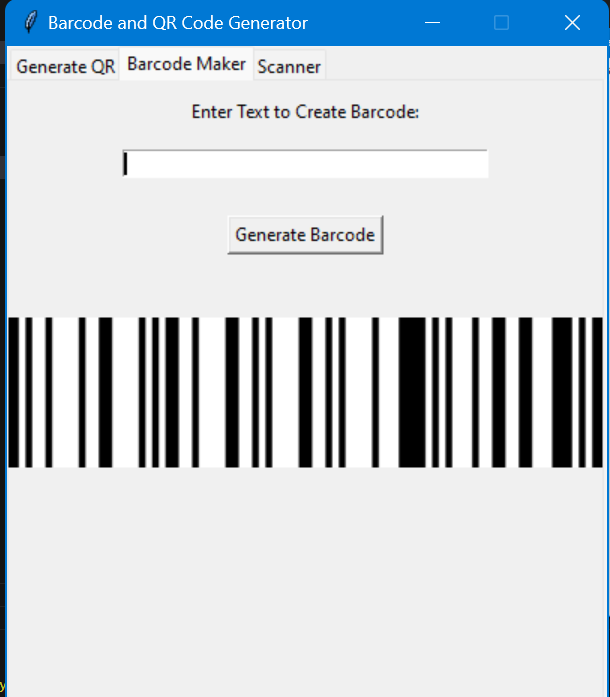
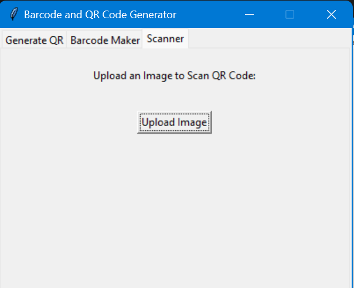

Here is a sample `README.md` for the code you provided:

# Barcode and QR Code Generator with Tkinter

This is a Python application that allows users to generate, scan, and customize QR codes and barcodes using the Tkinter GUI framework. The application provides three main functionalities:



1. **QR Code Generator** - Allows users to create a QR code from text or URL with custom colors.



2. **Barcode Generator** - Allows users to generate barcodes using the Code 128 encoding scheme.



3. **QR Code Scanner** - Allows users to upload an image and scan the QR code present in the image.

## Features
- **QR Code Generator**: 
  - Generate QR codes from text or URLs.
  - Customizable QR code color.
  - Automatically save the generated QR code as a `.png` file.
- **Barcode Generator**:
  - Create barcodes using the Code 128 encoding scheme.
  - Save generated barcode as `.png` image.
- **QR Code Scanner**:
  - Upload an image to scan for QR codes.
  - Display the decoded data from the QR code.

## Requirements
- Python 3.x
- Tkinter (Usually comes pre-installed with Python)
- Pillow (for image manipulation)
- pyzbar (for QR code scanning)
- qrcode (for generating QR codes)

You can install the necessary dependencies with:

```bash
pip install pillow pyzbar qrcode
```

## How to Use
1. **Generate QR Code**:
   - Enter any text or URL in the input field.
   - Choose a custom QR code color by clicking the "Select Color" button.
   - Click "Generate QR Code" to generate the QR code and display it in the window.
   - The generated QR code will be saved as `qrcode.png`.

2. **Generate Barcode**:
   - Enter text to create a barcode.
   - Click "Generate Barcode" to generate the barcode and display it in the window.
   - The barcode will be saved as `barcode_new.png`.

3. **Scan QR Code**:
   - Click "Upload Image" to open a file dialog and select an image that contains a QR code.
   - The app will attempt to scan and decode the QR code from the selected image.
   - The decoded data will be displayed in the window.

## Usage Example

### QR Code Generation:
- Enter a URL such as `https://www.example.com`.
- Select a color for the QR code (optional).
- Click "Generate QR Code" to generate and save the QR code image.

### Barcode Generation:
- Enter any text (e.g., "Hello World").
- Click "Generate Barcode" to generate and display the barcode image.

### QR Code Scanning:
- Upload an image containing a QR code.
- The decoded data will be shown in the app.

## File Structure
```
- barcode_qr_code_app.py    # Main Python application file
- barcode_new.png           # Generated barcode image
- qrcode.png                # Generated QR code image
```

## License
This project is licensed under the MIT License - see the [LICENSE](LICENSE) file for details.

## Credits
- Barcode generation is done using the **Code 128** encoding scheme.
- QR code generation is powered by the **qrcode** library.
- QR code scanning is done using the **pyzbar** library.

## Acknowledgments
- Thanks to the libraries **Tkinter**, **Pillow**, **pyzbar**, and **qrcode** for making this project possible.
